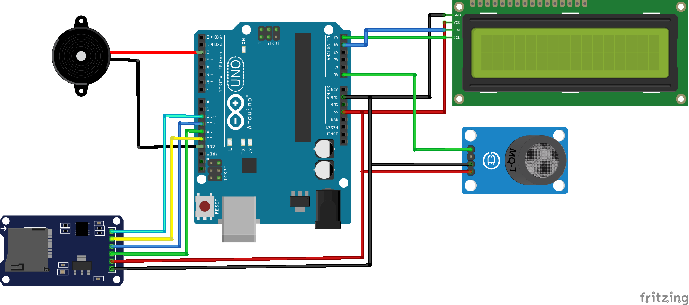

**Modul sensnor gas Arduino**

**Wiring diagram**

**Tabel wiring LCD 2x16 dengan I2C**

|**Pin I2C LCD**|**Pin Arduino**|
| :- | :- |
|VCC|5V|
|GND|GND|
|SDA|A4|
|SCL|A5|

**Tabel wiring sensor MQ-7 / MQ-135**

|**Pin Sensor**|**Pin Arduino**|
| :- | :- |
|VCC|5V|
|GND|GND|
|AO (Analog Output)|A0 |
|DO (Digital Output)|-|

**Tabel wiring buzzer**

|**Pin Buzzer**|**Pin Arduino**|
| :- | :- |
|VCC|D2 |
|GND|GND|

**Tabel wiring modul SD Card**

|**Pin modul SD Card**|**Pin Arduino**|
| :- | :- |
|VCC|3,3 V|
|GND|GND|
|MISO|D12|
|MOSI|D11|
|SCK|D13|
|CS|D10|

